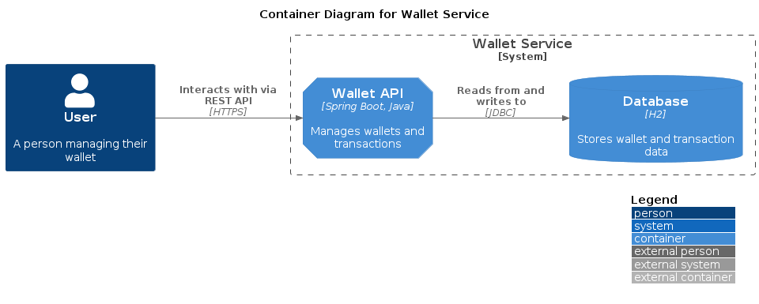
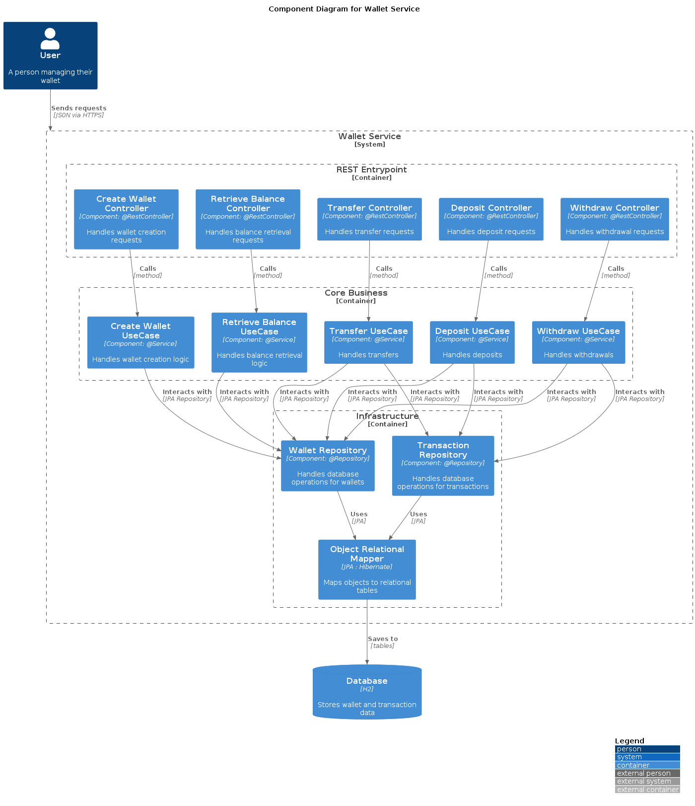

# Wallets Service

[](https://sonarcloud.io/summary/new_code?id=jtsato_wallet-service)
[](https://sonarcloud.io/summary/new_code?id=jtsato_wallet-service)
[](https://sonarcloud.io/summary/new_code?id=jtsato_wallet-service)
[](https://sonarcloud.io/summary/new_code?id=jtsato_wallet-service)

[](https://sonarcloud.io/summary/new_code?id=jtsato_wallet-service)
[](https://sonarcloud.io/summary/new_code?id=jtsato_wallet-service)
[](https://sonarcloud.io/summary/new_code?id=jtsato_wallet-service)
[](https://sonarcloud.io/summary/new_code?id=jtsato_wallet-service)

**Table of Contents**
* [Pre-requisites](#prerequisites)
* [Technology Stack](#technology-stack)
* [Container Diagram](#container-diagram)
* [Component Diagram](#component-diagram)
* [Running the application locally](#running-the-application-locally)
* [Running the tests locally](#running-the-tests-locally)
* [Available Endpoints](#available-endpoints)
* [Usecases](#usecases)
* [Solution Structure](#solution-structure)

## Prerequisites

* JDK 22
* This project uses Lombok, so enable annotation processing in your IDE

## Technology Stack
* Language: [`Java 22`](https://www.java.com/) 
* Compilation: [`Maven`](https://maven.apache.org/)
* Framework: [`SpringBoot`](https://spring.io/projects/spring-boot)
* Database: [`H2`](http://h2database.com/)
* Type-safe queries: [`Querydsl`](http://www.querydsl.com/)
* Entity Graph: [`JPA Entity Graph`](https://cosium.github.io/making-jpa-great-again/)
* Open API Documentation: [`springdoc-openapi`](https://springdoc.org/)
* Java bean mappings: [`MapStruct`](https://mapstruct.org/)
* Boilerplate code reducer: [`Lombok`](https://projectlombok.org/)
* Logging: [`SLF4J`](https://www.slf4j.org/)

* Tests: 
    * Unit Testing: [`JUnit5`](https://junit.org/junit5/docs/current/user-guide/) 
    * Mocking: [`Mockito`](https://site.mockito.org/)
    * Mutation: Testing [`PIT Mutation Testing`](https://pitest.org/)
    * Code Coverage: [`Jacoco`](https://www.jacoco.org)
    * Architecture Testing: [`ArchUnit`](https://www.archunit.org/)

## Container Diagram


## Component Diagram

  
## Running the application locally

```
mvn clean install -Dmaven.test.skip=true
mvn spring-boot:run -Dspring-boot.run.jvmArguments="-Dspring.profiles.active=test" -f ./configuration
```

## Running the tests locally

```
mvn -e clean install verify
```

## Available Endpoints

* Swagger UI: [`http://localhost:8081/swagger-ui.html`](http://localhost:8081/swagger-ui.html)
* H2 Console: [`http://localhost:8081/h2-console`](http://localhost:8081/h2-console)

## Usecases

### 1. Create Wallet: Allow the creation of wallets for users.
```
curl -X POST "http://localhost:8081/v1/wallets" \
-H "accept: */*" \
-H "Accept-Language: pt_BR" \
-H "Content-Type: application/json" \
-d '{"userId": "purple"}'
```

### 2. Retrieve Balance: Retrieve the current balance of a user's wallet.
```
curl -X GET "http://localhost:8081/v1/wallets/{walletId}/balances" \
-H "accept: */*" \
-H "Accept-Language: pt_BR"
```

### 3. Retrieve Historical Balance: Retrieve the balance of a user's wallet at a specif point in the past.
```
curl -X GET "http://localhost:8081/v1/wallets/{walletId}/balances/historical?startDate=2022-03-01T00:00:00Z&endDate=2022-03-31T23:59:59Z" \
-H "accept: */*" \
-H "Accept-Language: pt_BR"
```

### 4. Deposit Funds: Enable users to deposit money into their wallets.
```
curl -X POST "http://localhost:8081/v1/wallets/{walletId}/deposits" \
-H "accept: */*" \
-H "Accept-Language: pt_BR" \
-H "Content-Type: application/json" \
-d '{"amount": 100.50}'
```

### 5. Withdraw Funds: Enable users to withdraw money from their wallets.
```
curl -X POST "http://localhost:8081/v1/wallets/{walletId}/withdraws" \
-H "accept: */*" \
-H "Accept-Language: pt_BR" \
-H "Content-Type: application/json" \
-d '{"amount": 150.00}'
```

### 6. Transfer Funds: Facilitate the transfer of money between user wallets.
```
curl -X POST "http://localhost:8081/v1/wallets/{originWalletId}/transfers" \
-H "accept: */*" \
-H "Accept-Language: pt_BR" \
-H "Content-Type: application/json" \
-d '{"destinationWalletId": 2, "amount": 25.00}'
```

## Solution Structure

##### Core: Entities
* Represent your domain object
* Apply only logic that is applicable in general to the whole entity

##### Core: Use Cases
* Represent your business actions, it’s what you can do with the application. Expect one use case for each business action.
* Pure business logic
* Define interfaces for the data that they need in order to apply some logic. One or more providers will implement the interface, but the use case doesn’t know where the data is coming from.
* The use case doesn't know who triggered it and how the results are going to be presented.
* Throws business exceptions.

##### Providers
* Retrieve and store data from and to a number of sources (database, network devices, file system, 3rd parties, etc.)
* Implement the interfaces defined by the use case
* Use whatever framework is most appropriate (they are going to be isolated here anyway).
* Note: if using an ORM for database access, here you'd have another set of objects in order to represent the mapping to the tables (don't use the core entities as they might be very different).

##### Entrypoints
* They are ways of interacting with the application, and typically involve a delivery mechanism (e.g. REST APIs, scheduled jobs, GUI, other systems).
* Trigger a use case and convert the result to the appropriate format for the delivery mechanism
* A GUI would use MVC (or MVP) in here; the controller would trigger a use case

##### Configuration
* Wires everything together.
* Frameworks (e.g. for dependency injection) are isolated here
* Has the "dirty details" like Main class, web server configuration, datasource configuration, etc.

## Testing Strategy
##### Unit Tests
* for TDD (a.k.a. Tests first, to drive design).
* Cover every little detail, aim for 100% coverage.
* “Dev to dev” documentation: What should this class do?
* Test individual classes in isolation, very fast.

##### Integration Tests
* Test integration with slow parts (http, database, etc.)
* “Dev” documentation: Does this work as expected?
* Test one layer in isolation (e.g. only rest endpoint, or only data provider). Slow
* Use whatever library makes it easy

## Resources
##### Blogs & Articles
* The Clean Architecture https://blog.8thlight.com/uncle-bob/2012/08/13/the-clean-architecture.html
* Screaming Architecture http://blog.8thlight.com/uncle-bob/2011/09/30/Screaming-Architecture.html
* NODB https://blog.8thlight.com/uncle-bob/2012/05/15/NODB.html
* Hexagonal Architecture http://alistair.cockburn.us/Hexagonal+architecture

##### Videos & Presentations
* Clean Architecture https://www.youtube.com/results?search_query=clean+architecture
* Hexagonal Architecture https://www.youtube.com/results?search_query=hexagonal+architecture
* Clean Code https://www.youtube.com/results?search_query=clean+code
